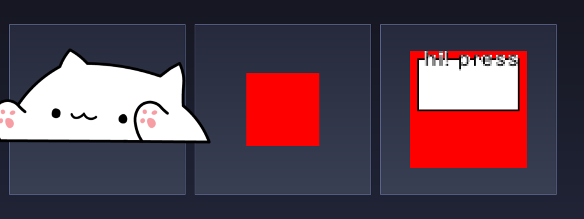
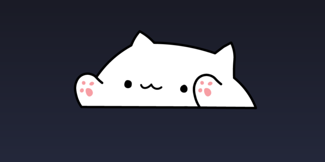
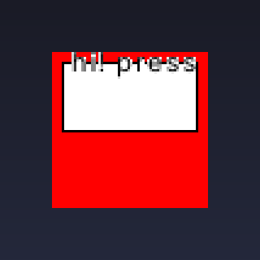

# PetWeave

一个 **Wayland 原生的桌宠框架**：运行时 + SDK 约定，让"做一个桌宠"变成"写一个角色包"。内置 BongoCat，支持零代码精灵宠物与 Lua 脚本宠物。

<p align="center">
  
  <br/>
  <sub>预置宠物：BongoCat 爪击（左）· blinky 网格宠物（中）· Lua 气泡宠物（右）</sub>
</p>

- 极轻量：实测空闲 RSS ≈ **5MB**、空闲 CPU ~0%（无 WebView/GTK/Qt 运行时）
- 原生 Wayland（`wlr-layer-shell`）：定位、全屏自动隐藏、多显示器、HiDPI
- 配置热重载、键盘热插拔、进程单例、优雅退出
- 预置宠物：`demo`（按键闪白）、`bongo`（BongoCat 爪击动画，wayland-bongocat 移植，SVG 睡眠帧）
- **角色包**：`.petweave` 格式 + 声明式精灵宠物（零代码）+ **Lua 脚本宠物**（mlua 沙箱、气泡对话），工具链 `install/uninstall/list/package/import`
- **生态开放**：创建角色包 → [docs/PACKAGES.md](docs/PACKAGES.md)（从零教程）· 贡献与投稿 → [CONTRIBUTING.md](CONTRIBUTING.md)

创新点说明见 [Innovation.md](Innovation.md) · 技术选型见 [docs/TECH_STACK.md](docs/TECH_STACK.md) · 实现计划见 [docs/ROADMAP.md](docs/ROADMAP.md)

## 构建

```bash
cargo build --release      # 产物: target/release/petweave
cargo test                 # 运行测试（55 项）
```

### 依赖
- Rust 1.80+（stable）
- Wayland 合成器（支持 `wlr-layer-shell`）：niri / Hyprland / Sway / KWin(Plasma 6) 等
- 键盘监听需要 `/dev/input` 权限（见下方「权限」）
- 角色包的气泡文字需要系统字体（AdwaitaSans / DejaVuSans 等，缺失时只显示气泡不显示文字）

## 运行

### 快速开始

```bash
./target/release/petweave                          # 启动 demo 宠物（默认配置）
./target/release/petweave --pet bongo              # 启动 BongoCat
./target/release/petweave -c ~/.config/petweave/petweave.toml
```

启动后宠物显示在屏幕底部（默认 anchor=bottom，margin 16px）。**BongoCat 会在你按键时击打对应爪子**——按键盘左侧的键（A/W/Q/…）动左爪，右侧（L/;/Space/…）动右爪，同时按则双爪齐下。

### 使用样例

#### 样例 A：开箱即用

```bash
petweave --pet demo               # 粉色方块，按键闪白
petweave --pet bongo              # BongoCat：按键击爪（尺寸由 cat_height 配置）
# 配置 cat_height 与睡眠（bongo 的尺寸/睡眠不走 --width 参数）：
cat > ~/.config/petweave/petweave.toml <<'EOF'
[pet]
kind = "bongo"
[pet.bongo]
cat_height = 200
idle_sleep_timeout_secs = 300     # 闲置 5 分钟入睡（SVG 睡眠帧）
EOF
petweave
```

<p align="center">
  
</p>

#### 样例 B：安装角色包并运行（bongo-sprite 全流程）

```bash
# 1) 安装仓库自带的预置包（目录或 .petweave 文件均可）
petweave install packages/bongo-sprite
petweave install packages/blinky
petweave list                     # 查看已安装

# 2) 写配置指向它
cat > ~/.config/petweave/petweave.toml <<'EOF'
[pet]
kind = "sprite"
package = "bongo-sprite"
name = "bongo"
EOF

# 3) 运行（配置修改会自动热重载）
petweave

# 4) 打包分发 / 卸载重装
petweave package packages/blinky -o blinky.petweave
petweave uninstall blinky
petweave install blinky.petweave   # 从 zip 包安装
```

效果：与内置 BongoCat 相同的爪击行为，但完全由 `pet.toml` 声明驱动（零代码）。

#### 样例 C：Lua 脚本宠物（lua-demo）

```bash
petweave install packages/lua-demo
cat > ~/.config/petweave/petweave.toml <<'EOF'
[pet]
kind = "lua"
package = "lua-demo"
name = "lua"
EOF
petweave
```

<p align="center">
  
  <br/>
  <sub>lua-demo：脚本驱动的气泡对话与动画切换</sub>
</p>

`packages/lua-demo/main.lua` 的行为：启动时气泡问候 → 按键播放 flash 动画并气泡显示键码 → CPU 超过 90% 时气泡提醒：

```lua
function init()
    pet.speak("hi! press keys")
end
function on_key(code, pressed)
    if pressed then
        pet.play("flash")
        pet.speak("key " .. code)
    end
end
function on_system(cpu, mem)
    if cpu > 90 then pet.speak("cpu is hot!") end
end
```

#### 样例 D：开发调试

```bash
petweave --preview out.png        # 无需 Wayland，把宠物当前帧导出为 PNG
petweave list-devices             # 识别键盘设备
petweave doctor                    # 环境体检（配置/会话/权限）
petweave import oneko.xpm -o oneko.png   # Oneko 的 XPM 精灵表 → PNG
```

### 命令行参数

| 参数 | 说明 | 示例 |
|---|---|---|
| `-c, --config <PATH>` | 指定 TOML 配置文件；未指定时尝试 `$XDG_CONFIG_HOME/petweave/petweave.toml` | `-c petweave.toml` |
| `--pet <demo\|bongo\|sprite\|lua>` | 覆盖 `pet.kind`（sprite/lua 还需配置 `pet.package`） | `--pet bongo` |
| `--width <N>` | 覆盖表面宽度（逻辑像素） | `--width 300` |
| `--height <N>` | 覆盖表面高度 | `--height 150` |
| `--fps <N>` | 覆盖动画帧率上限（1–240） | `--fps 60` |
| `--device <PATH>` | 显式指定输入设备，可重复 | `--device /dev/input/event6` |
| `--no-auto-input` | 关闭键盘自动探测 | |
| `--list-devices` | 列出探测到的键盘设备后退出 | |
| `--preview <PATH>` | 渲染宠物当前帧为 PNG 后退出（无需 Wayland，开发调试用） | `--preview out.png` |
| `-v, --verbose` | debug 日志（等价 `log_level = "debug"`，`RUST_LOG` 环境变量优先） | |

### 子命令

| 子命令 | 说明 |
|---|---|
| `petweave doctor [--apply]` | 诊断环境（配置/会话/键盘权限）；`--apply` 一键安装 udev uaccess 规则（需 root/sudo） |
| `petweave list-devices` | 同 `--list-devices`，列出键盘设备 |
| `petweave install <目录或.petweave>` | 安装角色包到本地仓库（`$XDG_DATA_HOME/petweave/pets/`） |
| `petweave uninstall <名字>` | 卸载角色包 |
| `petweave list` | 列出已安装的角色包 |
| `petweave package <目录> -o <输出>` | 把包目录打包成 `.petweave` zip |
| `petweave import <xpm> -o <png>` | Oneko 风格 XPM 精灵表 → PNG |

### 权限

宠物读取 `/dev/input/event*` 需要权限，两种方式任选：

```bash
# 方式 A（推荐）：udev uaccess 规则，随登录会话授权
petweave doctor --apply        # 或手动写入:
#   SUBSYSTEM=="input", KERNEL=="event*", TAG+="uaccess"
#   到 /etc/udev/rules.d/99-petweave-input.rules 后: sudo udevadm control --reload

# 方式 B：加入 input 组（需要重新登录）
sudo usermod -aG input $USER
```

用 `petweave doctor` 或 `petweave list-devices` 检查是否生效。

## 配置

配置文件为 TOML，**运行中修改会自动热重载**（300ms 防抖）。所有键都可省略，省略项用默认值。

### 完整示例

```toml
[general]
fps = 60                       # 动画帧率上限 1–240
log_level = "info"             # trace|debug|info|warn|error
sysinfo_interval_secs = 5      # CPU/内存采样间隔（秒），0=关闭 → 触发 Event::System
tray_enabled = true            # 托盘图标（左键显示/隐藏宠物，菜单含退出）

[input]
enabled = true                 # 全局键盘捕获开关
auto_detect = true             # 自动探测 /dev/input/event*
devices = []                   # 显式设备路径（优先于自动探测）
scan_interval_secs = 30        # 热插拔重扫间隔；未找到设备时 5s 快速重试

[render]
width = 256                    # 表面宽度（逻辑像素；bongo/角色包会用自身尺寸覆盖）
height = 256
layer = "top"                  # background|bottom|top|overlay
anchor = "bottom"              # top|bottom|left|right 的任意组合（| 分隔）
margin_top = 16
margin_right = 0
margin_bottom = 16
margin_left = 0
output = ""                    # 绑定指定显示器（xdg-output 名称），空=自动
disable_fullscreen_hide = false  # 全屏时也保持可见

[pet]
name = "bongo"                 # 宠物实例名（日志/ID）
enabled = true
kind = "demo"                  # demo | bongo | sprite | lua
package = ""                   # 角色包名或目录路径（kind = sprite/lua 时必填）
color = "#ff6699"              # demo 宠物基础色（#rrggbb 或 #rrggbbaa）

[pet.bongo]                    # 仅 kind = "bongo" 时生效
assets_dir = "assets/bongocat" # 素材目录（PNG 帧 + bongo-sleeping.svg）
cat_height = 110               # 猫高（像素），宽按素材宽高比自动
keypress_duration_ms = 100     # 按下后爪子保持时长（毫秒）
hand_mapping = true            # 按物理位置映射左右爪
mirror_x = false               # 水平翻转（并交换左右爪）
idle_sleep_timeout_secs = 0    # 闲置 N 秒后入睡（SVG 睡眠帧），0=关闭
enable_scheduled_sleep = false # 定时睡眠窗口（墙钟）
sleep_begin = "22:00"          # 睡眠窗口开始（24h）
sleep_end = "06:00"            # 睡眠窗口结束（24h）
```

完整示例见 [`petweave.toml.example`](petweave.toml.example)；角色包清单（`pet.toml`）的**从零创建教程、字段全参考、Lua 进阶玩法、发布自检清单**见 [docs/PACKAGES.md](docs/PACKAGES.md)。

## 加入 PetWeave 生态

PetWeave 的长期生命力来自**大家一起创作角色包**。三种参与方式任选：

1. **做宠物（最简单）**：按 [docs/PACKAGES.md](docs/PACKAGES.md) 从零创建——目录 + `pet.toml` + 素材即可，零代码精灵宠物或 Lua 脚本宠物，`--preview` 无需 Wayland 即可调试，`petweave package` 一键打包发布。
2. **投稿**：把做好的 `.petweave` 发布到 GitHub Releases，并按 [CONTRIBUTING.md](CONTRIBUTING.md) 提交到社区列表，让更多人用上你的宠物。
3. **写框架**：M3 交互升级（拖拽/物理/多宠物/托盘）、M4 深度集成（GPU/Live2D）都等着你，见 [docs/ROADMAP.md](docs/ROADMAP.md) 与 [CONTRIBUTING.md](CONTRIBUTING.md)。

> 社区列表（`docs/ECOSYSTEM.md`）正在建设中——你的第一个角色包，就是它的第一条记录。 🐾

### 行为说明

- **热重载**：改 `[render]` 的 layer/anchor/margins 与 `[pet]`/`[pet.bongo]` 参数即时生效（bongo 改 `cat_height` 会重新缩放）；改 `pet.kind` 或 `render.output` 需重启。
- **睡眠**：`idle_sleep_timeout_secs` 到期或处于定时窗口时显示"睡着"的猫（官方 SVG 素材栅格化）；定时睡眠期间按键被忽略，闲置睡眠按键即可唤醒。
- **全屏隐藏**：检测到（激活的）全屏窗口时自动隐藏宠物；`layer = "overlay"` 或 `disable_fullscreen_hide = true` 可跳过。注意：niri 未实现 `wlr-foreign-toplevel-management`，此功能在其上不生效（优雅降级，始终显示）。
- **托盘**：注册 StatusNotifierItem（需要桌面环境/面板提供 StatusNotifierWatcher）；左键切换宠物显示/隐藏，右键菜单可退出；无 Watcher 时优雅跳过。
- **单例**：同账号同时只能运行一个实例（flock 型 PID 文件 `$XDG_RUNTIME_DIR/petweave.pid`）。
- **多显示器/HiDPI**：`render.output` 指定显示器名称（`wlr-randr` / `niri msg outputs` 查看）；整数倍缩放按 buffer_scale 物理渲染，高分屏下清晰。
- **系统感知**：`sysinfo_interval_secs` 间隔向宠物推送 CPU/内存快照；Lua 宠物可写 `on_system(cpu, mem)` 响应（如 CPU 过载提醒）。
- **Lua 沙箱**：脚本运行在 mlua 白名单环境（无 io/os/package/debug），指令预算防死循环，脚本报错只记日志。

## 故障排查

| 现象 | 处理 |
|---|---|
| `list-devices` / `doctor` 显示没有键盘或权限拒绝 | 按「权限」一节配置，然后重新登录会话 |
| 宠物不响应按键 | 运行 `petweave list-devices` 确认设备被识别；在 `[input] devices` 里显式指定 |
| 角色包加载失败（`failed to load ... pet`） | 运行 `petweave list` 确认已安装；包名填错或目录路径不对时按提示修正；`--preview` 可在无 Wayland 下快速验证 |
| 提示 `another petweave instance is already running` | 已有一个实例在运行（或 `$XDG_RUNTIME_DIR` 异常） |
| 启动报 `wlr-layer-shell not available` | 当前合成器不支持 layer-shell（如 GNOME/Mutter），见兼容性说明 |
| 找不到猫素材 | 在仓库根目录运行，或把 `assets/bongocat` 复制到运行目录并配置 `assets_dir` |

## 项目结构

```
crates/
  petweave-core/   共享类型：config / events / manifest / Pet trait / render Frame
  petweave/        主机：cli / app(事件循环) / package / platform / graphics / runtime
assets/bongocat/   内置 BongoCat 素材（PNG 帧 + sleeping SVG，MIT，署名见目录内 README）
packages/          预置角色包：bongo-sprite（声明式 BongoCat）/ blinky（网格示例）/ lua-demo（Lua 示例）
docs/              技术栈分析 + 实现计划 + 角色包教程 + Live2D 路线 + 社区列表 + 配图
petweave.toml.example
```
